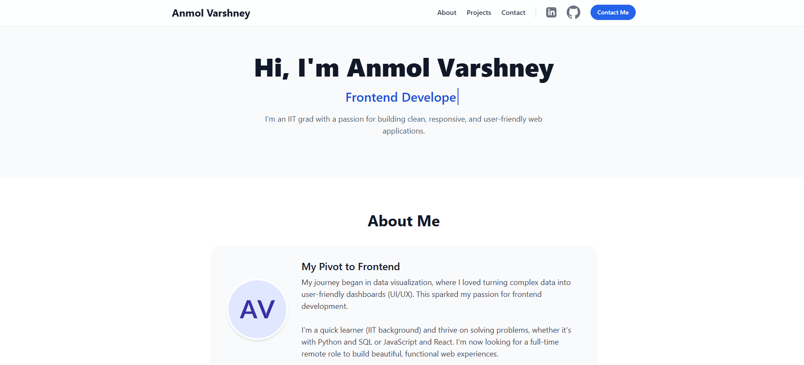

<!-- README.md -->

<p align="center">
  
</p>

<h1 align="center">Anmol Varshney — Personal Portfolio</h1>

<p align="center">
  <a href="https://anmol-portfolio-v1.vercel.app/" target="_blank">Live demo → anmol-portfolio-v1.vercel.app</a>
  &nbsp;•&nbsp;
  <a href="https://github.com/Anmol272001/anmol-portfolio-v1/issues">Report bug / Request feature</a>
</p>

<p align="center">
  <a href="https://github.com/Anmol272001/anmol-portfolio-v1/stargazers"></a>
  <a href="https://github.com/Anmol272001/anmol-portfolio-v1/actions"></a>
  <a href="https://github.com/Anmol272001/anmol-portfolio-v1/blob/main/LICENSE"></a>
</p>

---

> **Summary:** A clean, fast single-page portfolio built with React + Tailwind to showcase frontend skills and a pivot from data visualization to product-focused UI development.

---

## 🔎 Table of contents
- [About](#about)  
- [Live demo](#live-demo)  
- [Tech stack](#tech-stack)  
- [Highlights](#highlights)  
- [Getting started](#getting-started)  
- [Project structure](#project-structure)  
- [Customize & deploy](#customize--deploy)  
- [For Interviewers](#for-interviewers)  
- [Contributing](#contributing)  
- [License & Contact](#license--contact)

---

## About
This portfolio emphasizes readable UI, responsive layout, and component-driven architecture. It’s intentionally minimal to let projects and story shine — fast to load, easy to maintain, and easy to extend.

---

## Live demo
**https://anmol-portfolio-v1.vercel.app/**

---

## Tech stack
- **React.js** (functional components, hooks)  
- **Tailwind CSS** (utility-first styling)  
- **JavaScript (ES6+)**  
- **Vercel** (CI / deployment)  
- Dev tools: VS Code, Prettier, ESLint

---

## Highlights
- Clean, modern design with a typewriter headline effect.  
- Fully responsive: mobile → desktop.  
- Projects data kept in one place (easy to update or wire to a CMS).  
- Simulated API and loading states to show async handling.  
- Focus on accessibility, semantics, and SEO-ready meta.  

---

## Getting started

### Prerequisites
- Node.js (v16+ recommended)  
- npm or yarn

### Install & run locally
```bash
# clone
git clone https://github.com/Anmol272001/anmol-portfolio-v1.git
cd anmol-portfolio-v1

# install
npm install
# or
yarn

# dev
npm start
# or
yarn start
# open http://localhost:3000
